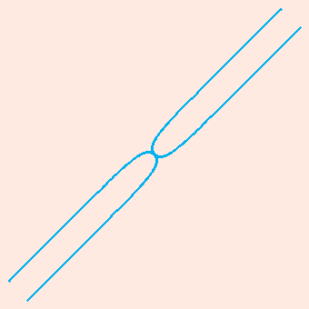
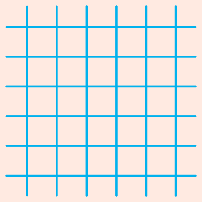
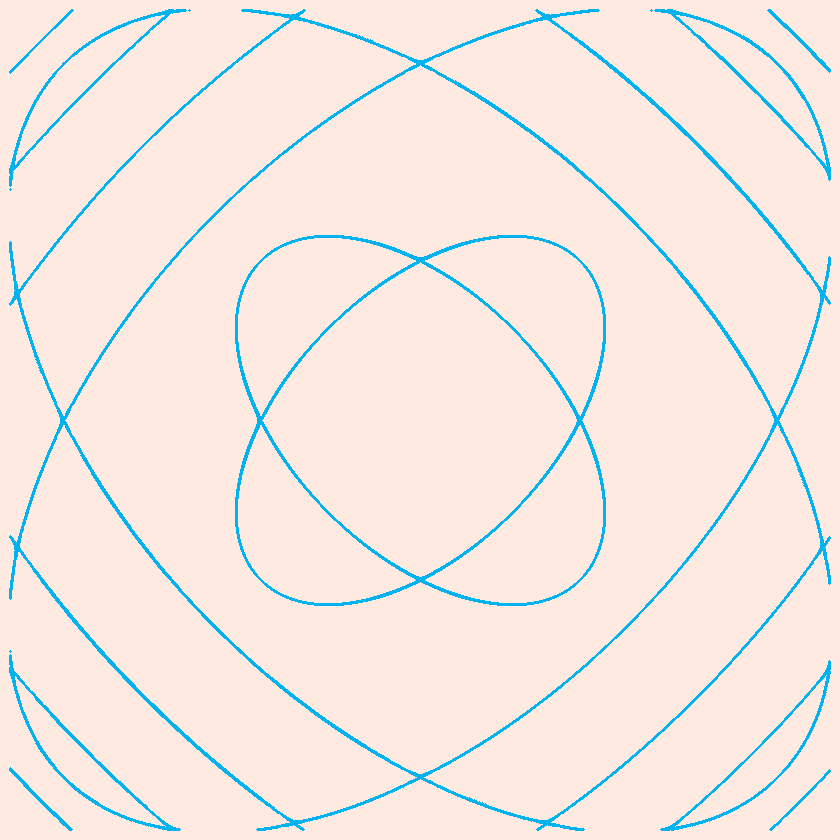
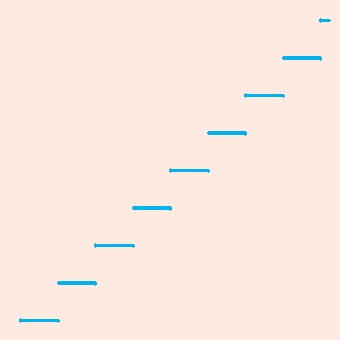
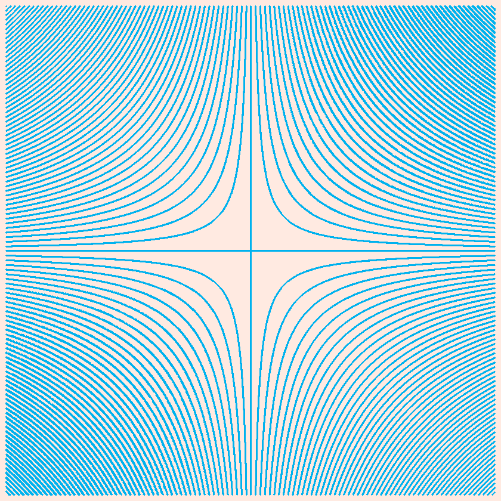
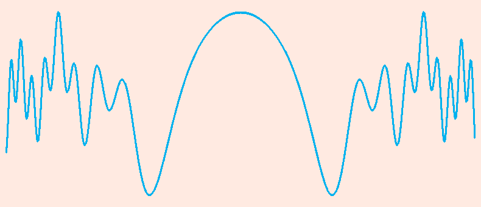

## A plot tool Based on C

### dependency
- [svpng](https://github.com/miloyip/svpng)
- cmake 3.10
- gcc

### build
```sh
git clone https://github.com/jingtianer/cplot
cd cplot
mkdir cmake-build-debug
cmake .. 
make
make install
```
### Usage

#### USE_PNG
```sh
cplotter [normal|polar|parametric|function] "y1" "y2" "height" "x1" "x2" "width" "<expressions...>" 2>errs.log 1>out.png

# normal draw f(x,y)=0, f(x,y)<0, f(x,y)>0, f(x,y)<>0
# polar draw r=r(t) in polar coordinates
# parametric draw y=y(y),x=x(t)
# function draw y=f(x)
```

#### bool operator
```sh
# and: (&&) seperate expressions by ','
"expression1,expression2,..."
cplotter "-2" "2" 300 "-2" "2" 300 "x<1,x>-1,y<1,y>-1" 2>errs.log 1>out.png

# or:  (||) seperate by ' '
"expression1" "expression2"
cplotter "-2" "2" 300 "-2" "2" 300 "x>1" "x<-1" "y>1" "y<-1" 2>errs.log 1>out.png
```

### expression format
- rules
  - no blank characters
  - `pi` represents `circumference ratio, pi`, `e` represents `Euler's number, e`
  - all name of unary functions are upper case
  - must contains exactly one comparision operator
    - grater than: `>`
    - smaller than: `<` 
    - equals `=` 
    - not smaller than: `>=` 
    - not greater than: `<=` 
    - not equals: `<>`
  - `x` or `X` represents for x-Axis
  - `y` or `Y` represents for y-Axis
  - numbers
    - same rule with [strtold](https://en.cppreference.com/w/c/string/byte/strtof)
  - multiplier can not be ignored

### function list
> must be upper case

| function | explaination        |
| -------- | ------------------- |
| acos     | arccose             |
| asin     | arcsine             |
| atan     | arctangent          |
| cos      | cosine              |
| cosh     | hyperbolic cosine   |
| sin      | sine                |
| sinh     | hyperbolic sine     |
| tan      | tangent             |
| tanh     | hyperbolic tangent  |
| exp      | Exponential, Base e |
| log      | log                 |
| floor    | floor               |
| sqrt     | square root         |
| fabs     | absolute            |
| ceil     | ceil                |

## operators
| operators | explaination |
| --------- | ------------ |
| %         | mod          |
| *         | multiply     |
| +         | plus         |
| -         | minus        |
| /         | divide       |
| ^         | power        |

### configuration

all configuration defined in [config.h](./src/config.h)

## use cplot api

> example code
```c
#include <stdio.h>
#include <cplot.h>
#define PI 3.1415926

void init_cplot() {
    // use init_* api
    init__y1(-1);
    init__y2(1);
    init_x1(-PI);
    init_x2(PI);
    init_deltaX(2*PI);
    init_deltaY(2);
    init_sy(300);
    init_sx(300);
}

void init_cplot_by_args() {
    // use command line args
    char y1[] = "-1";
    char y2[] = "1";
    char x1[] = "-pi";
    char x2[] = "pi";
    char sx[] = "300";
    char sy[] = "300";
    char *args[] = {y1, y2, sy, x1, x2, sx, NULL};
    init(args);
}

void set_cplot_attrs(FILE *output) {
    set_brush_size(1); // px
    set_brush_color(0xffff00e0); // equivalent to 
    // set_R(0xff); set_G(0xff); set_B(0x00); set_A(0xe0);
    set_bg_color(0x000000ff); // equivalent to 
    // set_BG_R(0x00); set_BG_B(0x00); set_BG_B(0x00); set_BG_A(0xff);
    enable_fastmode(false);
    set_margin(15); // equivalent to 
    //set_LEFT_MARGIN(10); set_RIGHT_MARGIN(10); set_TOP_MARGIN(10); set_END_MARGIN(10);
    set_padding(10); // equivalent to 
    //set_LEFT_PADDING(10); set_RIGHT_PADDING(10); set_TOP_PADDING(10); set_END_PADDING(10);
    set_output_file(output);
    set_continuous_only(true); // draw continuous function only, better performance
    // set_logger_log_level(INFO_LOG);
    // set_x_axis(true, 0.1, 0xffffffff, 0.5); // enable x-axis, len of scale is 0.1, color is 0xffffffff, interval of scale is 0.5
    // set_y_axis(true, 0.1, 0xffffffff, 1); // enable y-axis, len of scale is 0.1, color is 0xffffffff, interval of scale is 1
    set_max_try(100); // max try, increase it to reduce the number of nonsequence posistion， decrease to gain better performance
}

int main(int argc, char** argv) {
    FILE *output = fopen("api.png", "wb");
    init_cplot();
    // init_cplot_by_args(); // or use command line args
    set_cplot_attrs(output);
    char expr0[] = "y=SIN(x)";
    char expr1[] = "y=COS(x)";
    char* plot_args[] = { expr0, expr1, NULL};
    plot_png(plot_args);
    fclose(output);
    return 0;
}
```
- more api examples: [demo](./demo/)

### build
```sh
$CC -o test_api test.c -I /usr/include/cplot/ -lcplot
```

### run
```sh
./test_api 2>errs.log 1>api.png
```

### api.png


## examples
















```sh
Usage: cplotter [normal|polar|parametric|function] y1 y2 sy x1 x2 sx expression
examples:
        cplotter function "0" 4 300 -1 2 300 "x*x" 2>errs1.log 1>out1.png
        cplotter polar "-11.1" "8" 300 "-9.6" "4*pi" 300 0 "4*pi" "300" "t" 2>errs2.log 1>out2.png
        cplotter polar "-10" "10" 300 "-10" "10" 300 0 "2*pi" "300" "TAN(t+pi/4)" 2>errs3.log 1>out3.png
        cplotter polar "-1" "1" 300 "-1" "1" 300 0 "10*pi" "300" "COS(1.8*t)" 2>errs4.log 1>out4.png
        cplotter parametric "-1" "1" 300 "-1" "1" 300 "0*pi" "2*pi" "300" "SIN(t)^3" "COS(t)^3" 2>errs5.log 1>out5.png
        cplotter normal "-1" 1 300 -1 1 300 "x*x+y*y-1=0" 2>errs6.log 1>out6.png
        cplotter normal "-pi/2" "pi/2" 300 "-3*pi" "2*pi" 300 "y^2-SIN(x+y)^2=0" 2>errs7.log 1>out7.png
        cplotter normal "-pi/2" "pi/2" 300 "-3*pi" "2*pi" 300 "y^2-SIN(x)^2=0" 2>errs8.log 1>out8.png
        cplotter normal "-2" "ACOS(1/2)-pi/4" 300 "-pi/2" "pi/2" 300 "y*y+x*x+y-SQRT(y*y+x*x)=0" 2>errs9.log 1>out9.png
        cplotter normal "-pi" "1" 300 "-2" "2" 300 "(ACOS(1-FABS(x))-pi)-y=0" "y-SQRT(1-(FABS(x)-1)^2)=0" 2>errs10.log 1>out10.png
        cplotter normal "-1" "pi/2" 300 "-1" "1" 300 "x*x+(y-FABS(x)^(2/3.0))^2-1=0" 2>errs11.log 1>out11.png
        cplotter normal "-4" "4" "300" "0" "2*pi" "300" "y-5*EXP(-x)*SIN(6*x)=0" 2>errs12.log 1>out12.png
        cplotter normal "0" "3" 300 "0" "9" 300 "y-SQRT(9-x)=0" 2>errs13.log 1>out13.png
        cplotter normal "0" "1" 300 "0" "1" 300 "y-X=0" 2>errs14.log 1>out14.png
        cplotter normal "-1.5*pi" "4.5*pi" 300 "-1.5*pi" "4.5*pi" 300 "SIN(X)+SIN(Y)=0" 2>errs15.log 1>out15.png
        cplotter normal "-1.5*pi" "4.5*pi" 300 "-1.5*pi" "4.5*pi" 300 "SIN(X)*SIN(Y)=0" 2>errs16.log 1>out16.png
        cplotter normal "-8*pi" "8*pi" 300 "-8*pi" "8*pi" 300 "COS(x+SIN(y))-TAN(y)=0" 2>errs17.log 1>out17.png
        cplotter normal "-pi" "1" 300 "-2" "2" 300 "(ACOS(1-FABS(x))-pi)-y<=0,y-SQRT(1-(FABS(x)-1)^2)<=0" 2>errs18.log 1>out18.png
        cplotter normal "-1" "2" 300 "-1" "4" 300 "y-x=0,y-SQRT(x)=0" 2>errs19.log 1>out19.png
        cplotter normal "-1" "2" 300 "-1" "4" 300 "y-x=0" "y-SQRT(x)=0" 2>errs20.log 1>out20.png
        cplotter normal "-2*pi" "2*pi" "800" "-2*pi" "2*pi" "800" "SIN(X*x+Y*y)-SIN(X)-SIN(Y)=0" 2>errs21.log 1>out21.png
        cplotter normal "-pi" "pi" "800" "-pi" "pi" "800" "SIN(X*x+Y*y)-COS(X*Y)=0" 2>errs22.log 1>out22.png
        cplotter normal "-pi" "pi" "800" "-pi" "pi" "800" "SIN(X*x+Y*y)-COS(X-Y)=0" 2>errs23.log 1>out23.png
        cplotter normal "-4" "4" "300" "-4" "4" "300" "FLOOR(X)-y=0" 2>errs24.log 1>out24.png
        cplotter normal "-4*pi" "4*pi" "800" "-4*pi" "4*pi" "800" "SIN(SIN(X*Y))=0" 2>errs25.log 1>out25.png
        cplotter normal "-1" 1 300 -8 8 300 "(COS(pi*X)+COS(pi*X^2))/2=y" 2>errs26.log 1>out26.png
        cplotter normal "-1" 1 300 -2.5 2.5 300 "(COS(pi*X)+COS(pi*X^2)+COS(pi*X^3))/3=y" 2>errs27.log 1>out27.png
        cplotter normal "-3*pi/2" "3*pi/2" 300 "-3*pi/2" "3*pi/2" 300 "SIN(x*x)+SIN(y*y)=1"  2>errs28.log 1>out28.png
        cplotter normal "-10" "10" 300 "-10" "10" 300 "Y=X^X"  2>errs29.log 1>out29.png
        cplotter normal "0" "10" 300 "-8" "8" 300 "Y=10/(1+EXP(-X))" 2>errs30.log 1>out30.png
        cplotter normal "-1" "1" 300 "-2*pi" "2*pi" 300 "Y=SIN(1/X)" 2>errs31.log 1>out31.png
        cplotter normal "-SQRT(2*pi*(1/4+8))" "SQRT(2*pi*(1/4+8))" 800 "-SQRT(2*pi*(1/4+8))" "SQRT(2*pi*(1/4+8))" 800 "SIN(x*x+y*y)=1" 2>errs32.log 1>out32.png
```