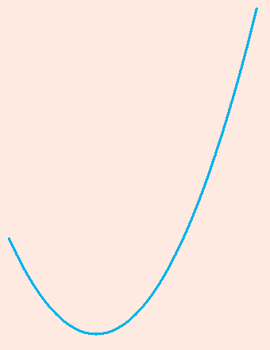
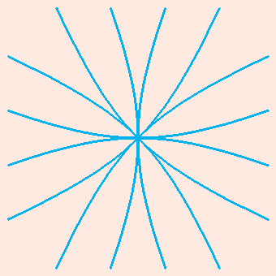
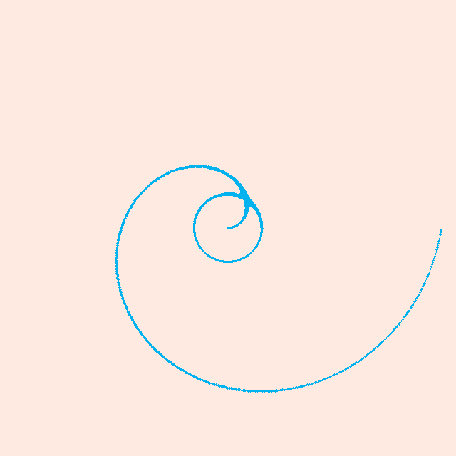
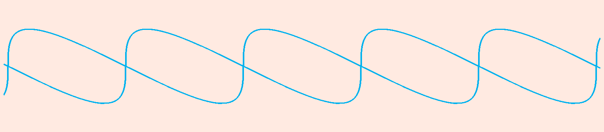
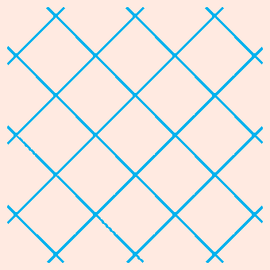
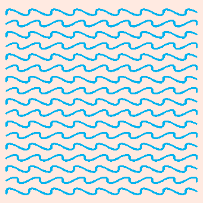
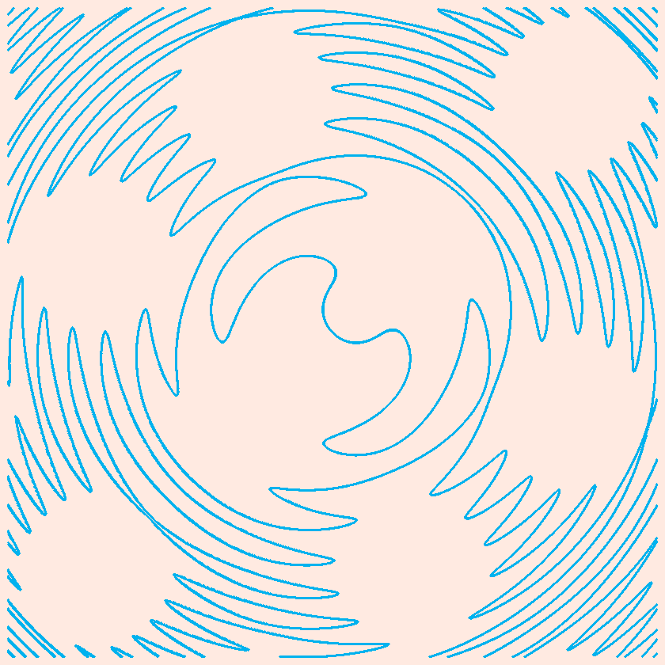

## A plot tool Based on C

### dependency
- [svpng](https://github.com/miloyip/svpng)
- cmake 3.10
- gcc

### build
```sh
git clone https://github.com/jingtianer/cplot
cd cplot
mkdir cmake-build-debug
cmake .. 
make
make install
```
### Usage

#### USE_PNG
```
cplot "y1" "y2" "height" "x1" "x2" "width" "<expressions...>" 2>errs.log 1>out.png
```

#### bool operator
```sh
# and: seperate expressions by ','
"expression1,expression2,..."
cplot "-2" "2" 300 "-2" "2" 300 "x<1,x>-1,y<1,y>-1" 2>errs.log 1>out.png
# or: 
"expression1" "expression2"
cplot "-2" "2" 300 "-2" "2" 300 "x>1" "x<-1" "y>1" "y<-1" 2>errs.log 1>out.png
```

### expression format
- rules
  - no blank characters
  - `pi` represents `circumference ratio, pi`, `e` represents `Euler's number, e`
  - all name of unary functions are upper case
  - must contains exactly one comparision operator
    - grater than: `>`
    - smaller than: `<` 
    - equals `=` 
    - not smaller than: `>=` 
    - not greater than: `<=` 
    - not equals: `<>`
  - `x` or `X` represents for x-Axis
  - `y` or `Y` represents for y-Axis
  - numbers
    - same rule with [strtold](https://en.cppreference.com/w/c/string/byte/strtof)
  - multiplier can not be ignored

### function list
> must be upper case

|function|explaination|
|-|-|
|acos|arccos|
|asin|arcsin|
|atan|arctan|
|cos|cosine|
|cosh|hyperbolic cosine|
|sin|sine|
|sinh|hyperbolic sine|
|tan|tangent|
|tanh|hyperbolic tangent|
|exp|Exponential, Base e|
|log|log|
|floor|floor|
|sqrt|square root function|
|fabs|absolute|
|ceil|ceil|

## operators
|operators|explaination|
|-|-|
|%|mod|
|*|multiply|
|+|plus|
|-|minus|
|/|div|
|^|pow|

### configuration

all configuration defined in`config.h`

## use cplot api

> example code
```c

#include <stdio.h>
#include <stdlib.h>
#include <cplot.h>
#include <string.h>
#define PI 3.1415926

void init_cplot() {
    init__y1(-1);
    init__y2(1);
    init_x1(-PI);
    init_x2(PI);
    init_deltaX(2*PI);
    init_deltaY(2);
    init_s1(300);
    init_s2(300);
}

void set_cplot_attrs() {
    set_brush_size(1);
    set_brush_color(0xffff00e0);
    set_bg_color(0x000000ff);
    enable_fastmode(false);
    set_margin(15);
    set_padding(10);
}

int main(int argc, char** argv) {
    init_cplot();
    set_cplot_attrs();
    char* expr0 = strdup("y=SIN(x)");
    char* expr1 = strdup("y=COS(x)");
    char* plot_args[] = { expr0, expr1, NULL };
    plot_png(plot_args);
    free(expr0);
    free(expr1);
    return 0;
}
```

### build
```sh
$CC -o test_api test.c -I /usr/include/cplot/ -lcplot
```

### run
```sh
./test_api 2>errs.log 1>api.png
```

### api.png


## examples

```sh
Usage: cplotter y1 y2 sy x1 x2 sx expression
examples:
        cplotter "-1" 1 300 -1 1 300 "x*x+y*y-1=0" 2>errs.log 1>out1.png
        cplotter "-pi/2" "pi/2" 300 "-3*pi" "2*pi" 300 "y^2-SIN(x+y)^2=0" 2>errs.log 1>out2.png
        cplotter "-pi/2" "pi/2" 300 "-3*pi" "2*pi" 300 "y^2-SIN(x)^2=0" 2>errs.log 1>out3.png
        cplotter "-2" "ACOS(1/2)-pi/4" 300 "-pi/2" "pi/2" 300 "y*y+x*x+y-SQRT(y*y+x*x)=0" 2>errs.log 1>out4.png
        cplotter "-pi" "1" 300 "-2" "2" 300 "(ACOS(1-FABS(x))-pi)-y=0" "y-SQRT(1-(FABS(x)-1)^2)=0" 2>errs.log 1>out5.png
        cplotter "-1" "pi/2" 300 "-1" "1" 300 "x*x+(y-FABS(x)^(2/3.0))^2-1=0" 2>errs.log 1>out6.png
        cplotter "-4" "4" "300" "0" "2*pi" "300" "y-5*EXP(-x)*SIN(6*x)=0" 2>errs.log 1>out7.png
        cplotter "0" "3" 300 "0" "9" 300 "y-SQRT(9-x)=0" 2>errs.log 1>out8.png
        cplotter "0" "1" 300 "0" "1" 300 "y-X=0" 2>errs.log 1>out9.png
        cplotter "-1.5*pi" "4.5*pi" 300 "-1.5*pi" "4.5*pi" 300 "SIN(X)+SIN(Y)=0" 2>errs.log 1>out10.png
        cplotter "-1.5*pi" "4.5*pi" 300 "-1.5*pi" "4.5*pi" 300 "SIN(X)*SIN(Y)=0" 2>errs.log 1>out11.png
        cplotter "-8*pi" "8*pi" 300 "-8*pi" "8*pi" 300 "COS(x+SIN(y))-TAN(y)=0" 2>errs.log 1>out12.png
        cplotter "-pi" "1" 300 "-2" "2" 300 "(ACOS(1-FABS(x))-pi)-y<=0,y-SQRT(1-(FABS(x)-1)^2)<=0" 2>errs.log 1>out13.png
        cplotter "-1" "2" 300 "-1" "4" 300 "y-x=0,y-SQRT(x)=0" 2>errs.log 1>out14.png
        cplotter "-1" "2" 300 "-1" "4" 300 "y-x=0" "y-SQRT(x)=0" 2>errs.log 1>out15.png
        cplotter "-2*pi" "2*pi" "800" "-2*pi" "2*pi" "800" "SIN(X*x+Y*y)-SIN(X)-SIN(Y)=0" 2>errs.log 1>out16.png
        cplotter "-pi" "pi" "800" "-pi" "pi" "800" "SIN(X*x+Y*y)-COS(X*Y)=0" 2>errs.log 1>out17.png
        cplotter "-pi" "pi" "800" "-pi" "pi" "800" "SIN(X*x+Y*y)-COS(X-Y)=0" 2>errs.log 1>out18.png
        cplotter "-4" "4" "300" "-4" "4" "300" "FLOOR(X)-y=0" 2>errs.log 1>out19.png
        cplotter "-4*pi" "4*pi" "800" "-4*pi" "4*pi" "800" "SIN(SIN(X*Y))=0" 2>errs.log 1>out20.png
        cplotter "-1" 1 300 -8 8 300 "(COS(pi*X)+COS(pi*X^2))/2=y" 2>errs.log 1>out21.png
        cplotter "-1" 1 300 -2.5 2.5 300 "(COS(pi*X)+COS(pi*X^2)+COS(pi*X^3))/3=y" 2>errs.log 1>out22.png
        cplotter "-3*pi/2" "3*pi/2" 300 "-3*pi/2" "3*pi/2" 300 "SIN(x*x)+SIN(y*y)=1"  2>errs.log 1>out23.png
        cplotter "-10" "10" 2000 "-10" "10" 2000 "Y=X^X"  2>errs.log 1>out24.png
        cplotter "0" "10" 300 "-8" "8" 300 "Y=10/(1+EXP(-X))" 2>errs.log 1>out25.png
        cplotter "-1" "1" 300 "-2*pi" "2*pi" 300 "Y=SIN(1/X)" 2>errs.log 1>out26.png
```

















